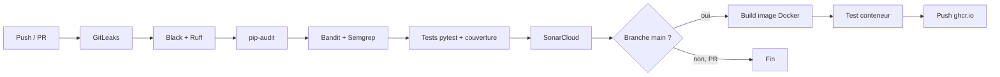

# Architecture

Application Flask packagée dans une image Docker (multi-stage build), buildée et testée par une pipeline CI/CD GitHub Actions, puis poussée sur ghcr.io.

## Pipeline CI/CD

```mermaid
flowchart LR
    A[Push / PR] --> B[GitLeaks]
    B --> C[Black + Ruff]
    C --> D[pip-audit]
    D --> E[Bandit + Semgrep]
    E --> F[Tests pytest + couverture]
    F --> G[SonarCloud]
    G --> H{Branche main ?}
    H -->|oui| I[Build image Docker]
    I --> J[Test conteneur]
    J --> K[Push ghcr.io]
    H -->|non, PR| L[Fin]
```